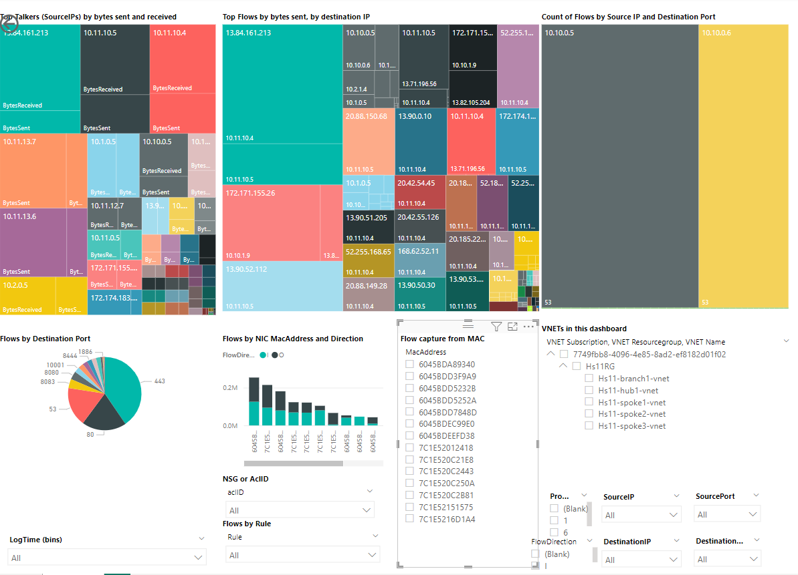
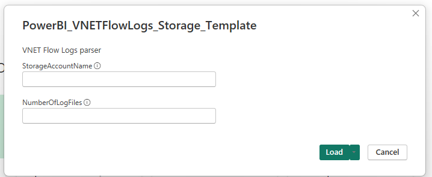
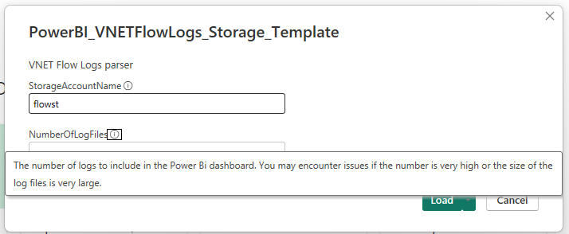
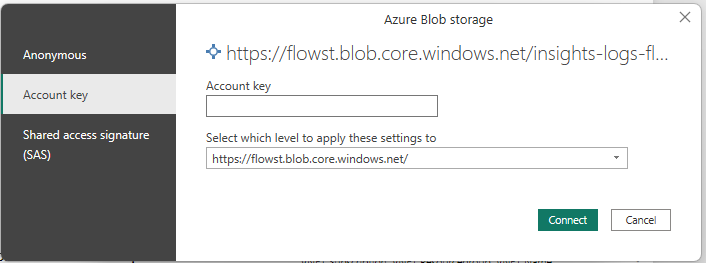
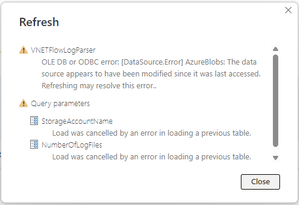
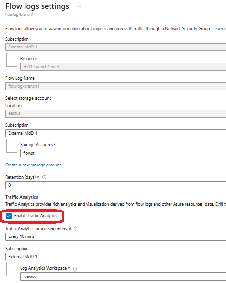
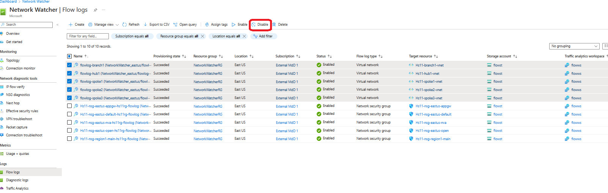
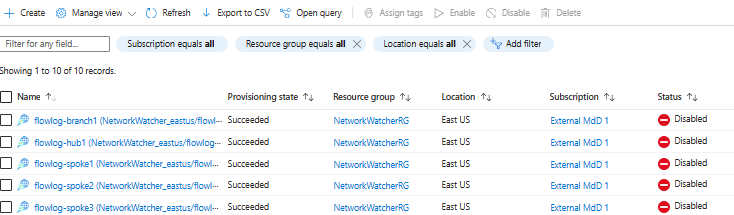
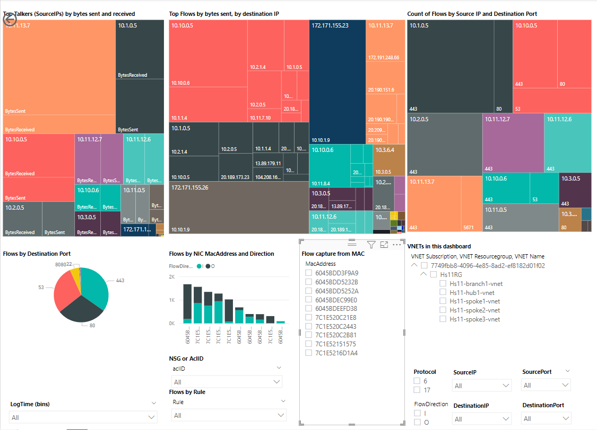
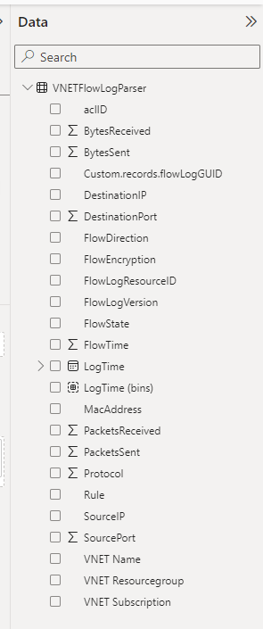

# **PowerBI Dashboard template for VNET Flow Logs**

This template creates a PowerBI dashboard for [VNET Flow Logs](https://learn.microsoft.com/en-us/azure/network-watcher/vnet-flow-logs-overview). It retrieves logs from blob storage, flattens the data through Power Query and visualizes the information on a dashboard.

The dashboard can be customized to fit specific needs, as all Flow Log fields are available in the PowerBI Data pane.

This template is derived from the dashboard for NSG Flow Logs [Visualizing Network Security Group flow logs with Power BI](https://learn.microsoft.com/en-us/azure/network-watcher/network-watcher-visualize-nsg-flow-logs-power-bi).

## Installation

1) Install [PowerBI Desktop](https://powerbi.microsoft.com/en-us/downloads/).
2) Download and save [PowerBI_VNETFlowLogs_Storage_Template_public.pbit](https://github.com/mddazure/vnet-flow-logs-powerbi/raw/main/PowerBI_VNETFlowLogs_Storage_Template.pbit) locally.
3) Double click the template file. PowerBI desktop will open and load the template.
4) Enter the name of the storage account where VNET Flow Logs are stored. 
Enter only the account name, not the full URL.

5) Enter the number of PT1H.json files to load.
VNET Flow Logs creates one file each hour for each NIC that it logs from. Multiply the count of NICs in the environment by the number hours to look back.

.

6) Enter the storage account key.

PowerBI will now load the data.

## Troubleshooting

PowerBI may display this error message:

 

This happens when a PT1H.json file is appended while the data is being loaded.

This is remediated by disabling the Flow Logs before loading data into PowerBI. In the Azure portal, navigate to the Flow logs blade under Network Watcher.

If Traffic Analytics is enabled for the Flows Logs, this needs to be disabled first. Click each Flow Log, uncheck Enable Traffic Analytics and Save.

Select the Flow Logs to disable and click Disable.

Wait a few minutes, then try to load the template again.

## Dashboard

Sample dashboard:

Flows are captured from NICs, identified by MAC address. Select a MAC to see flows captured from a single NIC (Flow Logs does not (yet) have the ability to match MAC addresses against NIC names for easy identification.

The dashboard can be customized with new visuals showing other (combinations of) data fields. All data fields logged by Flow Logs are contained in the Data Pane.

